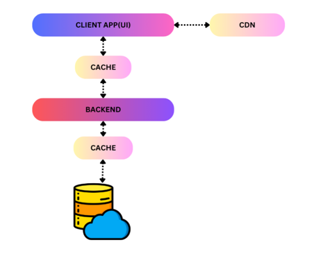
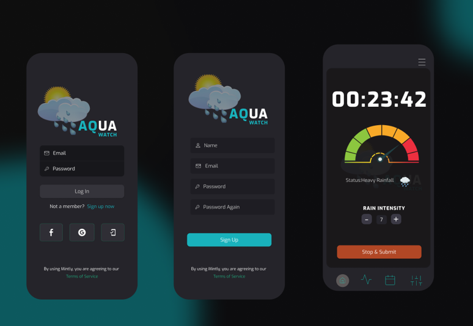

# Introduction

## 1.1 Background

Sri Lanka experiences diverse weather conditions throughout the year. The current system to forecast weather has not been able to provide accurate predictions. This situation has resulted in a need for a system to predict rainfall by collecting data across the island. This document outlines the requirements to develop a system for collecting rainfall data from individuals throughout the country.

## 1.2 Project Description and Importance

**AquaWatch** is a robust software solution designed to collect and manage rainfall data from individuals throughout the country. The application provides a user-friendly environment, ensuring the accuracy and reliability of rainfall data. AquaWatch records rainfall data along with GPS location, which is sent to a database used to improve current weather prediction models. This system will be helpful in agriculture, disaster management, improving safety, and more.

# System Requirements Analysis

## 2.1 Considering the average amount of data...

- The system should contain sufficient hardware to efficiently manage the process.
- Real-time data transmission is important between the user and the database.
- Security measures must ensure the safety of user information.
- Potential expansion of data inflow is a possible scenario.
- With the increase of data reception, it is possible to decrease the efficiency of the system.

# System Requirements Specification

## 3.1 Data Storage

One server should be sufficient to store the data received.

## 3.2 Hardware Specification of the Server

- 2 Cores
- 4GB Memory
- 2TB SATA
- 4TB Transfer

## 3.3 Data Transmission

A high-speed and reliable internet connection should be needed.

## 3.4 Security

Use TCP, SSL, TLS for secure data transmission.

## 3.5 Scalability

Server infrastructure should be designed such that the potential increase of data received can be accommodated in the database.

## 3.6 Performance

Cache memory should be added at the appropriate places to improve the efficiency of the system. The system should be designed such that further addition of cache memory is possible.

# Software Requirements Analysis

## 4.1 It is necessary to validate the data inflow...

- Protection of user information is important, and unauthorized logins should be prevented.
- After logging in, the user should be able to input data easily.
- There should be an option for users to clear their login data.
- The user should be able to input data accurately according to the observations.
- There should be a method to remind the user to submit data to increase accuracy.
- Security of user data and other data should be ensured.
- There should be a method to reduce the inaccuracy of data due to user errors.
- The application should be easy to navigate, simple, and understandable to the user.

# Software Requirements Specifications (SRS)

## 5.1 Functional Requirements

### 5.1.1 User Registration and Authentication

Users should be able to register by providing basic information without any complexities. The method of authentication should be secured to prevent unauthorized logins and maintain the security of data.

### 5.1.2 Login, Logout and Dashboard

- User should be directed to the dashboard once they are logged in.
- User should be able to logout and clean login data for additional security.

### 5.1.3 Collecting Data

#### 5.1.3.1 Recording Data

- User should be able to categorize the intensity of rain using a well-defined scale.
- Recording the starting time and ending time should be easy to implement.

#### 5.1.3.2 Location Data

- The system should be able to access the live location of the user using GPS to verify the validity of data.

### 5.1.4 Notification Access

- The system should be allowed to send notifications to the user.

## 5.2 Non-Functional Requirements

- Dashboard and other content should be loaded within 1 second.
- Password hashing and data encryption can be used to protect user data and collected data.
- If the user forgets to submit data after the rain stops, the system should be able to notify the user.
- Before submission, the user must confirm the validity of data.
- The collected data will be verified by comparing it with data received by other users in the same region during that period.
- A user-friendly interface should be designed, and the user should be able to use three languages: Sinhala, Tamil, and English.

# User-Interface

## 6.1 User Registration

User will be able to register using an email, mobile number, or using a given social media account (Facebook, Google).

## 6.2 Login Screen

User will be directed to the dashboard after logging in.

## 6.3 Dashboard

Dashboard will contain the button to start the recording of rainfall data. User will be able to select the status of the rain using a scale of 1-8 which will be simultaneously displayed graphically using a meter and an image relevant to the status. User will be able to adjust the status of the rain using the scale if needed. The time of rain will be displayed at the top of the screen.

--END--
